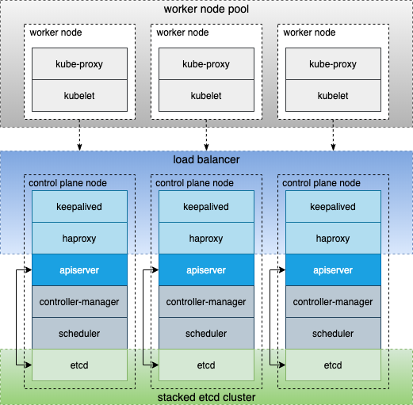

# Raspbernetes

This is an open source project designed to bootstrap a running Kubernetes cluster on Raspberry Pi's.

## Introduction

This guide will walk through the steps required to bootstrap a running Kubernetes cluster with a highly available topology. You will learn and configure the CRI and CNI of your choice (assuming it is supported) and understand how to setup load balancing between your multi master cluster.

> Note: If you wish to use Raspbian Lite please use the following [guide](raspbian/README.md).

## Prerequisites

Prior to getting started you will need to have several things done first. Assuming you already have the [hardware](#Hardware) available, you will need to do the following:

1. Flash OS onto SD card. Guide [Here](setup/README.md)
2. Install Ansible. Download [Here](https://docs.ansible.com/ansible/latest/installation_guide/intro_installation.html)
3. SSH connectivity to each node. (Step 1 requires you setup SSH keys)

## Getting Started

## Architecture

The following diagram demonstrates the overall cluster design. To obtain a highly available Kubernetes cluster we've chosen to use the [stacked etcd toplogy](https://kubernetes.io/docs/setup/production-environment/tools/kubeadm/ha-topology/#stacked-etcd-topology). This is the default configuration as the [external etcd cluster](https://kubernetes.io/docs/setup/production-environment/tools/kubeadm/ha-topology/#external-etcd-topology) alternative requires additional compute resources.

## Hardware
